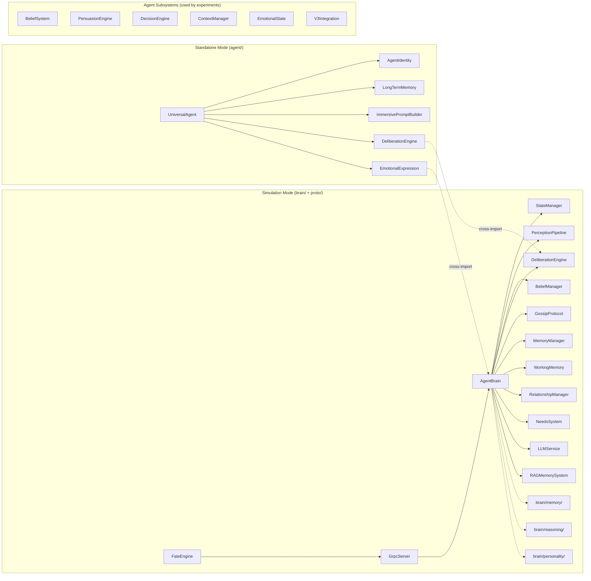

# OPUS ANALYSIS 2002 — Tsukuyomi Deep Codebase Review

> **Scope:** Source code only (no markdown docs). All findings derived from reading ~70+ files / ~28,000+ lines across `brain/`, `agent/`, `proto/`, `core/`.
>
> **Last verified:** 2026-02-20. Corrections applied after deep source code verification.

---

## 1. Architectural Overview

The codebase implements two **parallel and largely independent runtime modes**:

| Mode | Package | Entry Point | Runtime Model |
|---|---|---|---|
| **Simulation Mode** | `proto/` + `brain/` | `FateEngine` → `GrpcServer` → `AgentBrain` | Tick-based (20 TPS), gRPC, deterministic loop |
| **Standalone Mode** | `agent/` | `UniversalAgent` | Request/response, direct LLM calls, async |

These two modes share **some code** — `UniversalAgent` imports `DeliberationEngine` from `brain/deliberation.py` and `EmotionalExpression` from `proto/emotional_expression.py` (relative imports at lines 27–28 of `universal_agent.py`). However, each mode still has its own emotional engine, memory system, and belief tracker — creating the project's core structural problem.

---

## 2. Critical Duplications

### 2.1 Emotional State — THREE implementations

| File | Class | Lines | Model |
|---|---|---|---|
| `brain/StateManager.py` | `StateManager` | 908 | PAD with inertia, episodes, impact rules |
| `agent/emotional_state.py` | `EmotionalState` | 515 | PAD with contagion, decay, tone detection |
| `agent/personality.py` | `PersonalityModel` | ~220 | Includes emotional baselines and responses |

> [!CAUTION]
> `StateManager` and `EmotionalState` both implement PAD (Pleasure-Arousal-Dominance) with nearly identical update/decay logic. Neither imports or extends the other. `PersonalityModel` adds yet another emotional layer on top.

**Impact:** Any emotional behavior fix must be applied in two or three places. Contagion logic exists only in `agent/`, regression-to-baseline only in `brain/`.

---

### 2.2 Memory — FOUR+ implementations

| File | Class | Lines | Backend |
|---|---|---|---|
| `brain/MemoryManager.py` | `MemoryManager` | 271 | In-memory 5W structure (who/what/when/where/why) |
| `brain/rag_memory.py` | `RAGMemorySystem` | 520 | Qdrant vector DB + embeddings |
| `agent/memory_system.py` | `LongTermMemory` | 567 | In-memory keyword-based retrieval |
| `brain/memory/` (V2) | `Memory`, `MemoryRetrieval`, `MemoryDecayCalculator` | ~1,800 | Tick-based decay, context-aware retrieval |

Additionally:
- `brain/WorkingMemory.py` (170L) — bounded cognitive buffer (Miller's Law)
- `agent/memory.py` (~230L) — `ConversationMemory` for V3 dialogue tracking

> [!WARNING]
> `MemoryManager` and `LongTermMemory` overlap significantly: both store episodic+semantic memories with importance scoring and retrieval.

> [!NOTE]
> **Correction:** `RAGMemorySystem` is **NOT dead code**. `AgentBrain.__init__` (line 98–102) instantiates it with `in_memory=True`, and the `_deliberate()` method (lines 373–393) actively calls `retrieve_memories()` and `format_context_for_llm()` every deliberation cycle. `AgentBrain` uses BOTH `MemoryManager` AND `RAGMemorySystem` concurrently.

The `brain/memory/` subdirectory is a V2 implementation (Phase 15: Deep Memory Architecture) with its own `MemoryType` enum (5 values), decay calculator, and retrieval system. It has unit tests but is **not yet wired into `AgentBrain`**.

---

### 2.3 Belief Systems — TWO implementations

| File | Class | Lines |
|---|---|---|
| `brain/BeliefManager.py` | `BeliefManager` | 307 |
| `agent/belief_system.py` | `BeliefSystem` | 1548 |

**Key differences:**
- `BeliefManager`: Simple evidence + stance calculation, formatted for LLM prompts
- `BeliefSystem`: Full lifecycle with confidence decay, contradiction detection, bias modeling, perturbation, memory integration

`BeliefSystem` is 5× more sophisticated but shares zero code with `BeliefManager`. The V3 integration layer (`v3_integration.py`) uses `BeliefSystem` exclusively.

---

### 2.4 `MemoryType` Enum — Defined FIVE times

| Location | Values |
|---|---|
| `brain/rag_memory.py` | EPISODIC, SEMANTIC, PROCEDURAL, WORKING |
| `brain/memory/memory_types.py` | EPISODIC, SEMANTIC, EMOTIONAL, SOCIAL, PROCEDURAL |
| `agent/memory_system.py` | EPISODIC, SEMANTIC, EMOTIONAL |
| `agent/identity.py` | FORMATIVE, TRAUMATIC, JOYFUL, DEFINING |
| `agent/memory.py` | (implicit via utterance tracking) |

Each defines its own incompatible `MemoryType` enum. No shared definition exists.

---

## 3. Dead Code & Unused Modules

### 3.1 ~~Confirmed Dead Code~~ Corrected

> [!IMPORTANT]
> **CORRECTION:** The original analysis incorrectly claimed the RAG stack was dead code. `AgentBrain.__init__` (line 98–102) instantiates `RAGMemorySystem` and `_deliberate()` calls it every cycle. The earlier analysis was factually wrong.

| Module | Original Claim | Actual Status |
|---|---|---|
| `brain/rag_memory.py` (520L) | Dead | ✅ **LIVE** — instantiated in `AgentBrain.__init__` line 102, used in `_deliberate()` |
| `brain/embedding_service.py` (335L) | Dead | ✅ **LIVE** — imported by `rag_memory.py` which IS used |
| `brain/vector_store.py` (386L) | Dead | ✅ **LIVE** — imported by `rag_memory.py` which IS used |
| ~~`agent/proposal.py`~~ | Dead | ⚠️ **Wrong filename** — actual file is `agent/proposal_handler.py`, imported in `__init__.py` and used in experiments |
| ~~`agent/context.py`~~ | Dead | ⚠️ **Wrong filename** — actual file is `agent/context_manager.py`, used in experiments (`run_oracle_experiment.py`, `run_full_integration.py`) |

### 3.2 Verified Module Status

| Module | Status | Evidence |
|---|---|---|
| `agent/persuasion.py` (947L) | ✅ **Used in experiments** | Imported and instantiated in `run_oracle_experiment.py` (line 41), `run_full_integration.py` (line 43) |
| `agent/decision_engine.py` (602L) | ✅ **Used in experiments** | Imported and instantiated in `run_v2_smart.py` (line 60), `run_v2_experiment.py` (line 103) |
| `agent/v3_integration.py` (391L) | ⚠️ **Partially dead** | `V3AgentMixin` never subclassed. `enhance_agent()` never called in experiments. Has tests in `agent/tests/test_v3_integration.py` |
| `brain/CatalystSystem.py` (138L) | Uncertain | Only referenced by `DramaDirector` |
| `brain/conversation/` (2 files) | ⚠️ **Unintegrated** | Zero external imports — `conversation_state.py` and `sentiment_analyzer.py` have no callers |

---

## 4. Architectural Gaps

### 4.1 No Shared Abstractions

The two modes (`brain/` and `agent/`) define no shared interfaces or abstract base classes. There is no:
- `BaseEmotionalEngine` that both `StateManager` and `EmotionalState` implement
- `BaseMemoryStore` that all memory systems implement
- `BaseBeliefTracker` that both belief systems implement

This makes it impossible to swap implementations or test one mode's logic against another.

### 4.2 Configuration Fragmentation

| What | Where | Format |
|---|---|---|
| FateEngine config | `fate_engine.py` constructor | kwargs with defaults |
| Agent personality | `identity.py` → `PersonalityTraits` | Dataclass (openness, conscientiousness, etc.) |
| Emotional baseline | `StateManager.py` → `PersonalityBaseline` | Separate dataclass (PAD values) |
| LLM config | `LLMService.py` → constructor | Direct params |
| gRPC config | `grpc_server.py` → `GrpcServer.__init__` | host/port params |
| Scenario config | `fate_engine.py` → JSON file | Optional JSON path |

No unified config system exists. No environment variable loading pattern (despite `python-dotenv` in requirements).

### 4.3 Missing Error Handling Patterns

- `AgentBrain.run()` has a bare `while True` loop with basic try/except but no circuit breaker or backoff
- `LLMService` has retry logic but no rate limiting
- `GrpcServer` has no health check endpoint
- `FateEngine` has no graceful degradation when agents fail to respond within the proposal window

### 4.4 No Agent Lifecycle Management

There is no formal agent lifecycle (create → initialize → run → pause → stop → cleanup). `AgentBrain` has `run()` but:
- No `stop()` or `shutdown()` method
- No cleanup of gRPC channels
- No persistence of agent state between runs (`NeedsSystem` has `to_dict/from_dict`; `StateManager` has `get_state_dict()`; multiple `agent/` components have serialization — but no unified persistence layer)

### 4.5 Testing Coverage Gaps

The `conftest.py` defines markers for `benchmark`, `slow`, `integration`, and `postgresql`, but:
- No fixtures for creating test agents with standard profiles
- No mock LLM provider for unit testing
- No test for the critical path: `FateEngine` → `GrpcServer` → `AgentBrain` integration

---

## 5. Code Quality Issues

### 5.1 File Size Violations

Files exceeding 700 lines (the project's own stated limit):

| File | Lines | Recommendation |
|---|---|---|
| `agent/belief_system.py` | 1,548 | Extract evidence tracking, decay, and bias into sub-modules |
| `brain/PerceptionPipeline.py` | 1,366 | Split raycasting into separate module |
| `proto/fate_engine.py` | 1,190 | Extract resolution logic into `resolution.py` |
| `agent/persuasion.py` | 947 | Extract strategy calculation from engine |
| `brain/StateManager.py` | 908 | Extract impact rules into separate config |
| `brain/reasoning/reasoning_validator.py` | ~900 | Large V2 module — consider splitting |
| `brain/personality/drift_monitor.py` | ~880 | Large V2 module — consider splitting |
| `core/spatial_index.py` | 857 | Acceptable for a self-contained data structure |
| `brain/LLMService.py` | 825 | Extract prompt templates into separate file |

### 5.2 Hardcoded Domain Logic

> [!NOTE]
> **Correction:** `_load_scenario` is now config-driven (line 254–291). The code explicitly comments "This replaces the hardcoded medieval data with a flexible configuration system." The `_resolve_move`, `_resolve_examine`, and `_resolve_take` methods use generic distance/owner checks — NOT hardcoded location or object names.

**Remaining hardcoding concerns:**
- `default_scenario.json` still contains medieval tavern data (default scenario is domain-specific)
- `_generate_reflex_proposals` (line 953) hardcodes collection of `"food"` and `"tool"` object types
- The `ConversationManager` (`proto/conversation_manager.py`) has personality-extraction logic that assumes specific attribute names on agent objects (`_get_agent_personality` with multiple `getattr` fallbacks)

### 5.3 Inconsistent Naming

| Pattern | Example A | Example B |
|---|---|---|
| File casing | `AgentBrain.py` (PascalCase) | `emotional_state.py` (snake_case) |
| Class prefix | `StateManager` (no prefix) | `RAGMemorySystem` (acronym prefix) |
| Method naming | `to_llm_context()` | `format_for_prompt()` |
| ID generation | `uuid.uuid4()` in some | `f"dec_{random.randint()}"` in others |

The `brain/` package uses PascalCase filenames (`AgentBrain.py`, `StateManager.py`) while `agent/` uses snake_case (`emotional_state.py`, `belief_system.py`). Both are valid Python conventions, but mixing them in the same project is inconsistent.

ID generation is particularly concerning: `decision_engine.py` uses `random.randint(100000, 999999)` which has collision risk, while other modules properly use `uuid.uuid4()`.

### 5.4 Import Cycles Risk

`agent/__init__.py` (297 lines) imports and re-exports everything from all submodules. This creates a risk of circular imports if any submodule tries to import from the parent package. The file also has conditional imports with try/except blocks that silently swallow import errors.

---

## 6. V3 Architecture Layer

`agent/v3_integration.py` attempts to bridge the two architectures by providing:
- `enhance_agent()` — attaches V3 components to any agent object
- `enhance_prompt()` — enriches prompts with emotional/variety context
- `V3AgentMixin` — mixin class for adding V3 capabilities

**Problem:** V3 relies on duck-typing (checking `hasattr(agent, 'emotional_state')`) with no type safety. The mixin is defined but never applied to any class. The `enhance_agent()` function creates components and attaches them as attributes, which is brittle and untestable.

The V3 modules (`emotional_state.py`, `conversation.py`, `personality.py`, `memory.py`, `behavior.py`) appear to be a newer, more sophisticated version of agent capabilities. But they exist alongside the older `brain/` implementations without any migration path or deprecation markers.

---

## 7. Dependency Analysis

### 7.1 Dependency Status

| Dependency | Used By | Status |
|---|---|---|
| `qdrant-client` | `brain/vector_store.py` | ⚠️ **Uncertain** — RAG IS live but uses `in_memory=True`, so Qdrant client may not instantiate the external DB |
| `sentence-transformers` | `brain/embedding_service.py` | ⚠️ **Uncertain** — RAG config defaults to `EmbeddingProvider.LOCAL` with `all-MiniLM-L6-v2`, but `AgentBrain` doesn't override this |
| `asyncpg` | Not found in any import | ✅ **Completely unused** |
| `sqlalchemy` | Not found in any import | ✅ **Completely unused** |
| `numpy` | `brain/PerceptionPipeline.py` | ✅ Used for raycasting math |
| `pydantic` | Not found in any import (`from pydantic` grep: 0 results) | ✅ **Unused** despite being in requirements |
| `pyjwt` + `cryptography` | `proto/grpc_server.py` (JWT auth) | ✅ Used for session tokens |

> [!WARNING]
> 3 dependencies are confirmed unused: `asyncpg`, `sqlalchemy`, `pydantic`. `qdrant-client` and `sentence-transformers` may be indirectly needed by the live RAG stack (which runs in `in_memory` mode).

---

## 8. Missed Components: `brain/` V2 Subdirectories

The original analysis missed 4 populated subdirectories in `brain/`:

| Directory | Files | Total Size | Status |
|---|---|---|---|
| `brain/memory/` | 4 (`memory_types.py`, `decay_calculator.py`, `retrieval.py`, `__init__.py`) | ~66 KB | Has tests. Used in 1 experiment. **Not wired into `AgentBrain`** |
| `brain/reasoning/` | 5 (`decision_record.py`, `confidence_calibration.py`, `reasoning_validator.py`, `reasoning_logger.py`, `__init__.py`) | ~95 KB | Has tests. Phase 17: Reasoning Transparency. **Not wired into `AgentBrain`** |
| `brain/personality/` | 4 (`profile.py`, `constraint_sampler.py`, `drift_monitor.py`, `__init__.py`) | ~80 KB | Has tests. **Not wired into `AgentBrain`** |
| `brain/conversation/` | 2 (`conversation_state.py`, `sentiment_analyzer.py`) | ~32 KB | **Zero external imports** — fully isolated dead code |

These V2 modules represent ~273 KB of code (~7,000+ lines) that is tested but awaiting integration with `AgentBrain`.

---

## 9. Summary of Findings

### By Severity

| Severity | Count | Key Issues |
|---|---|---|
| 🔴 Critical | 2 | Duplicate emotional engines (3 PAD implementations), 4+ memory systems (with name collisions) |
| 🟠 High | 4 | No shared abstractions, no agent lifecycle, ~273KB of unintegrated V2 brain/ modules, V3 mixin layer unused |
| 🟡 Medium | 5 | File size violations (9 files >700L), inconsistent naming, ID collision risk, config fragmentation, unused deps |
| 🔵 Low | 3 | Import cycle risk, missing error patterns, testing gaps |

### Recommended Actions (Priority Order)

1. **Unify emotional state** — Pick `StateManager` or `EmotionalState`, create a shared `BaseEmotionalEngine` interface, delete the other
2. **Unify memory** — Consolidate `MemoryManager`, `RAGMemorySystem`, `brain/memory/`, and `LongTermMemory` — they all serve overlapping purposes
3. **Integrate V2 brain/ modules** — Wire `brain/memory/`, `brain/reasoning/`, `brain/personality/` into `AgentBrain` or decide to remove them
4. **Unify beliefs** — Extract shared logic from `BeliefManager` and `BeliefSystem` into common module
5. **Clean dependencies** — Remove `asyncpg`, `sqlalchemy`, `pydantic`
6. **Resolve V3 architecture** — `V3AgentMixin` and `enhance_agent()` are unused — either complete the migration or remove
7. **Add shared interfaces** — Define abstract base classes for emotional, memory, and belief components
8. **Split oversized files** — Target the 9 files exceeding 700 lines
9. **Standardize naming** — Pick one convention (snake_case files recommended for Python)
10. **Fix ID generation** — Replace all `random.randint` IDs with `uuid.uuid4()`
11. **Add agent lifecycle** — Implement `start/stop/pause/resume/cleanup` on `AgentBrain`

---

*Analysis generated from source code inspection only. Verified 2026-02-20 against actual imports, instantiation sites, and experiment usage.*
